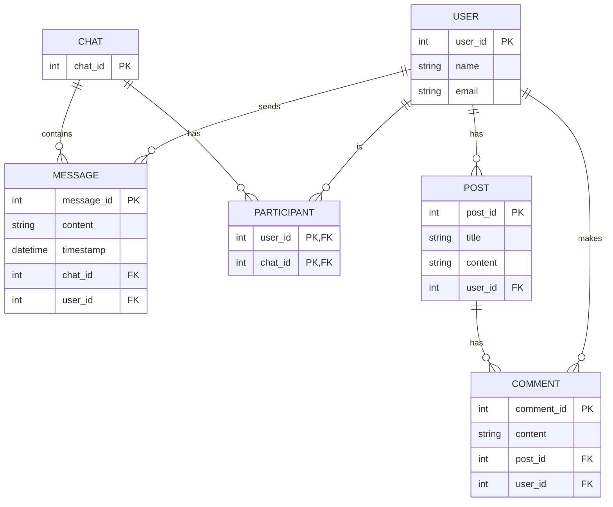

# Mock Social Network Database Specification

## Description

1. **User Entity**: This would be a table that contains user information. Attributes could include `UserID` (Primary Key), `Name`, and `Email`.

2. **Post Entity**: This would be a table that contains posts made by users. Attributes could include `PostID` (Primary Key), `Title`, `Content`, and `UserID` (Foreign Key referencing User).

3. **Comment Entity**: This would be a table that contains comments made on posts. Attributes could include `CommentID` (Primary Key), `Content`, `PostID` (Foreign Key referencing Post), and `UserID` (Foreign Key referencing User).

4. **Chat Entity**: This would be a table that contains chat sessions. Attributes could include `ChatID` (Primary Key).

5. **Message Entity**: This would be a table that contains messages sent in a chat. Attributes could include `MessageID` (Primary Key), `Content`, `Timestamp`, `ChatID` (Foreign Key referencing Chat), and `UserID` (Foreign Key referencing User).

6. **Participant Entity**: This would be a table that contains information about which users are in which chats. Attributes could include `UserID` (Foreign Key referencing User) and `ChatID` (Foreign Key referencing Chat). This table would have a composite primary key of `UserID` and `ChatID`.

In this model:

- A `User` can have many `Posts`.
- A `Post` can have many `Comments`.
- A `User` can have many `Comments`.
- A `Chat` can have many `Messages`.
- A `User` can have many `Messages`.
- A `User` can participate in many `Chats` and a `Chat` can have many `Users` (represented by the `Participant` entity).

## Diagram

### Mermaid

### SVG

